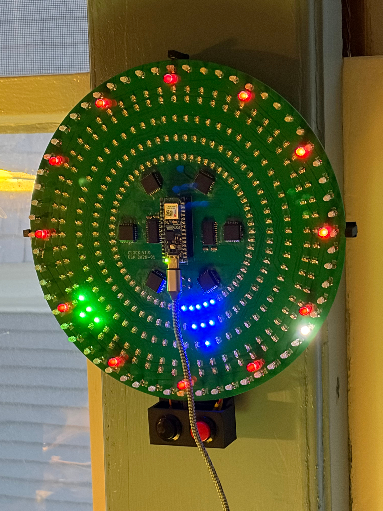

# LED Clock

Yet another LED pseudo-analog clock.
 6 concentric circles of 60 LEDs plus one of 12 LEDs.
 Arduino Nano ESP32.

Current code (`clock_v2`) just uses 1Hz timer interrupts
and provides hour / minute set buttons.

No ECOs on the PC board.  Forgot mounting holes though.
See `Case` folder for a two-part 3D printed wall hangar
with a little control panel for the set buttons.

Works OK but loses ~1min/day.  Need to work on the timekeeping.

### 2026-04-12

Working on SimpleRTC add-on to keep better time.
 Need a serial port on the ESP32.
 It's confusing:
https://forum.arduino.cc/t/nano-esp32-onboard-uart-and-pin-numbering-issues/1269099/9

I _think_ this should work:

    Serial1.begin(1200, SERIAL_8N1, D11, D12);
	
